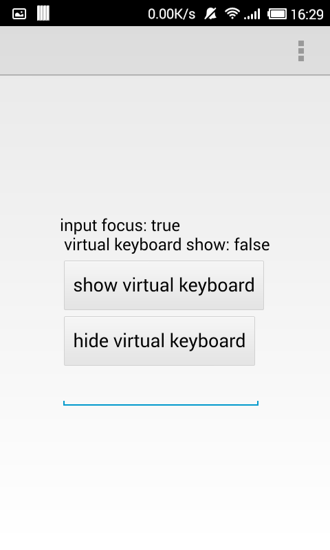
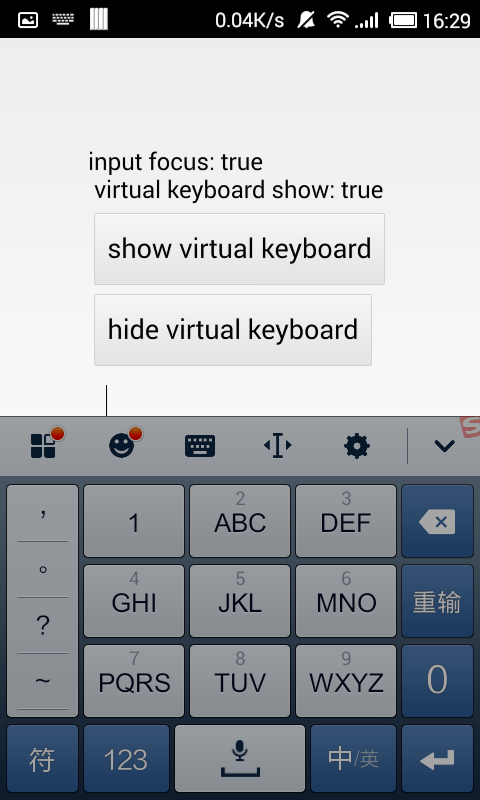
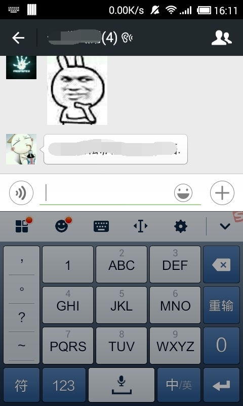

# qml 开发安卓应用

这里记下遇到的一些 **Bugs**

## 弹出输入法后，页面无法自适应大小

在弹出输入法后，页面中的输入框一定会在输入面板的顶部。但这个是通过移动窗体完成的。就是让窗体移动到输入框刚好在虚拟键盘上方的位置。所以诸如 `MenuBar`，`ToolBar` 会移动到界面外。





原生的安卓应用，在弹出虚拟键盘时，界面可以自适应，且工具栏不会被弹走。



测试代码如下：

```qml
import QtQuick 2.4
import QtQuick.Controls 1.3
import QtQuick.Window 2.2
import QtQuick.Dialogs 1.2
import QtQuick.Layouts 1.1

ApplicationWindow {
    title: qsTr("Hello World")
    width: 640
    height: 480
    visible: true

    menuBar: MenuBar {
        Menu {
            title: qsTr("&File")
            MenuItem {
                text: qsTr("E&xit")
                onTriggered: Qt.quit();
            }
        }
    }

    property bool getFocus: true

    ColumnLayout {
        id: layout
        anchors.centerIn:parent
        focus: true

        Text {
            text: "input focus: "+input.focus + "\n virtual keyboard show: " + Qt.inputMethod.visible
        }

        Button {
            text: "show virtual keyboard"
            onClicked: {
                Qt.inputMethod.show();
            }
        }

        Button {
            text: "hide virtual keyboard"
            onClicked: {
                Qt.inputMethod.hide();
            }
        }

        TextField {
            id:input
            focus: getFocus

            Component.onCompleted: {
                console.log("TextField");
                Qt.inputMethod.visibleChanged.connect(function(visible){
                    Qt.inputMethod.visibleChanged.disconnect(arguments.callee);
                    if(Qt.inputMethod.visible && input.focus) {
                        Qt.inputMethod.hide();
                    }
                    console.log("Qt.inputMethod.visibleChanged");
                });
            }
        }
    }
    Component.onCompleted: {
        console.log("ApplicationWindow");
        console.log(Qt.inputMethod.keyboardRectangle)
        console.log("Qt.inputMethod.keyboardRectangle.width: ",Qt.inputMethod.keyboardRectangle.width)
        console.log("Qt.inputMethod.keyboardRectangle.height: ", Qt.inputMethod.keyboardRectangle.height)
        console.log("Qt.inputMethod.keyboardRectangle.x: ", Qt.inputMethod.keyboardRectangle.x)
        console.log("Qt.inputMethod.keyboardRectangle.y: ", Qt.inputMethod.keyboardRectangle.y)
        Qt.inputMethod.visibleChanged.connect(function(visible){
            console.log("ApplicationWindow x move: ", x);
            console.log("ApplicationWindow y move: ", y);
            console.log(Qt.inputMethod.keyboardRectangle)
            console.log("Qt.inputMethod.keyboardRectangle.width: ",Qt.inputMethod.keyboardRectangle.width)
            console.log("Qt.inputMethod.keyboardRectangle.height: ", Qt.inputMethod.keyboardRectangle.height)
            console.log("Qt.inputMethod.keyboardRectangle.x: ", Qt.inputMethod.keyboardRectangle.x)
            console.log("Qt.inputMethod.keyboardRectangle.y: ", Qt.inputMethod.keyboardRectangle.y)
        });
    }
}
```

解决办法：

直接在 `AndroidManifest.xml` 中的 `activity` 标签中添加属性。

```
android:windowSoftInputMode="adjustResize"
```

但是在输入法弹出的时候，会闪屏。

[android:windowSoftInputMode属性详解](http://blog.csdn.net/twoicewoo/article/details/7384398)

[Android中的windowSoftInputMode属性详解](http://www.jb51.net/article/56043.htm)

[SmoothEmotionKeyBoard](https://github.com/cpoopc/SmoothEmotionKeyBoard)

通过分析，界面一定是从底下被向上顶。所以顶部的 TopBar 要做适应的下移动操作。但是 QtQuick.Control 本身位于顶部的 `ToolBar` 是不能移动的，参考 [Sparrow]()。这里取 [Sparrow]() 为我们开发移动程序的框架。

下移动操作需要获取当前弹出键盘高度。

参考：

[Android获取屏幕高度、状态栏高度、标题栏高度](http://blog.csdn.net/xinhai657/article/details/16863679)

[Android 如何实现在隐藏键盘后，让输入框保持当前高度，类似QQ、微信聊天窗口。](http://segmentfault.com/q/1010000003046282)

[如何获得软键盘的尺寸信息？](http://segmentfault.com/q/1010000000397807)

由于 Qt on Android 的启动方式是配合 Activity 的。所以要对原生安卓开发有一些必要的认识。

```java
public static void listenKeyboardHeight() {
        if(!hasListenVirtualKeyboard) {
            final View myRootView = getRootView(m_instance);
            myRootView.getViewTreeObserver().addOnGlobalLayoutListener(
            new ViewTreeObserver.OnGlobalLayoutListener() {
                @Override
                public void onGlobalLayout() {

                    Rect outRect = new Rect();
                    m_instance.getWindow().getDecorView().getWindowVisibleDisplayFrame(outRect);

                    m_keyboardRectangle = new Rect();
                    myRootView.getWindowVisibleDisplayFrame(m_keyboardRectangle);

                    int screenHeight = myRootView.getRootView().getHeight();
                    // 小于100 就不行了
                    // 这里还要减去状态栏的高度
                    // 魔幻数字
                    int magic = 5;
                    int virtualKeyboardHeight = screenHeight - (m_keyboardRectangle.bottom - m_keyboardRectangle.top) - outRect.top - magic;

                    if( virtualKeyboardHeight < 100 ) {
                        virtualKeyboardHeight = 0;
                    }

                    QtNative.notifiedKeyboardRectangle(
                            m_keyboardRectangle.centerX(),
                            m_keyboardRectangle.centerY(),
                            m_keyboardRectangle.width(),
                            virtualKeyboardHeight);
                }
            });
            hasListenVirtualKeyboard = true;
        }
    }
```

其中 `QtNative.notifiedKeyboardRectangle` 为 c++ 中的方法。用于更新键盘单例对象的高度。

```cpp
int main(int argc, char *argv[])
{
    QApplication app(argc, argv);

    //! [java register native function]
#ifdef Q_OS_ANDROID
    qDebug() << "QtNative::registerNativeMethod : " << QtNative::registerNativeMethod();
#endif
    //! [java register native function]

```

在应用正式加载 qml 之前注册 java 的 native 方法。再注册其余的 qml type。

```cpp
    context->setContextProperty("Keyboard", Keyboard::singleton());
```

然后向 qml 环境注册一个自定义的键盘单例。键盘单例是平台无关的。如果是安卓平台，在 java 代码那边写入一个监听事件，监听键盘弹出时的界面变化，计算出键盘高度。然后调用 `QtNative.notifiedKeyboardRectangle` 这个注册到 java 的 native 方法。就可以更新 `Keyboard::singleton()` 这个单例中键盘的高度。在 qml 中就可以触发信号处理器。

---

## Window 上 qml 播放多媒体问题

```
DirectShowPlayerService::doRender: Unresolved error code 80040266
```

下载安装 [LAV Filters](http://forum.doom9.org/showthread.php?t=156191)

## 安卓上多窗体切换容易出问题

安卓上，除了对话框之外，就只维护一个 `Window` 或者 `ApplicationWindow`。

## 不要把 VisualItemModel 赋给 Repeater model

```
Repeater {
    model: itemsModel
    Button {
        text: "button"
    }
}
VisualItemModel {
    id: itemsModel
}
```

## Qt on Android WebView 的 url

assets:/html/index

qrc:/index.html

这两种方式在安卓上的WebView都不管用。

首先安卓上 qrc 以及 assets 的资源都是以二进制方式存在的，其次安卓上的 WebView 是使用原生控件在 QtSurface 上绘制的。所以对于 qrc 资源，访问失败，如果直接使用 assets:/ 也会失败。使用 file:///android_asset/ + 文件名。

[安卓——如何获取Assets的路径 ](http://blog.sina.com.cn/s/blog_6b2ad0530101nl0r.html)