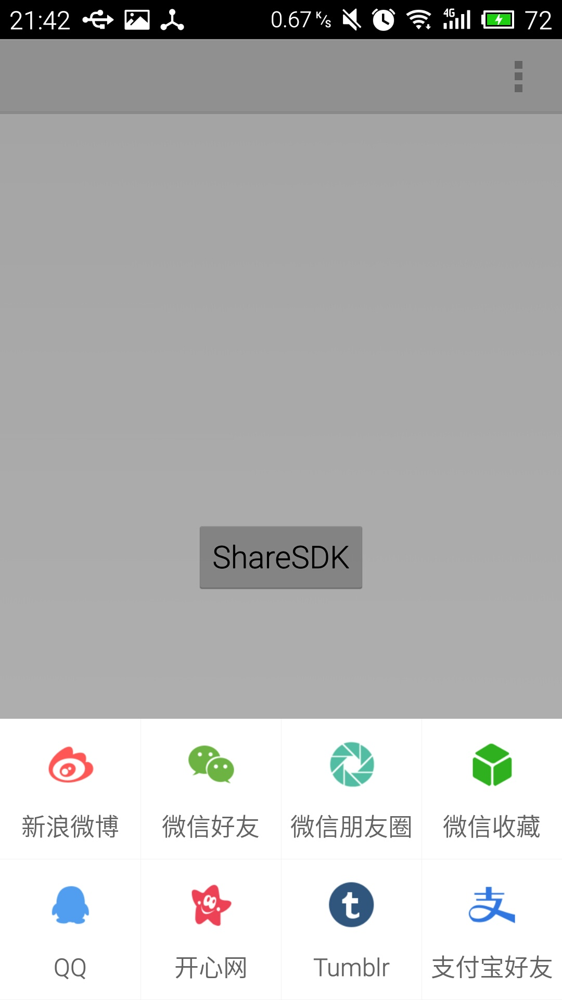

# 在 Qt 上使用 ShareSDK 进行社交集成

> Qt 5.5.1

> ShareSDK for Android 2.7

## 下载 ShareSDK

## 集成 ShareSDK

### 使用 QtCreator 生成安卓项目文件

安装如下图的方式，添加模板。默认生成即可。


### 使用 `QuickIntegrater.jar` 生成

参考[视频: Android 快速集成第一步](http://v.youku.com/v_show/id_XODI3ODk2OTgw.html)。

> QuickIntegrater会自行产生一个文件夹，复制此文件夹中所有文件到您的项目中覆盖即可。Window 7 下会提示合并。

> **注意**：由于 Qt 是使用 `ant` 编译 apk 的，如果使用 `QuickIntegrater.jar` 选择了过多的功能项，就会在编译时，提示**命令行太长**，编译失败.解决办法是，不要全选所有的功能，其次，例如一些境外社交的功能集成就可以考虑不要。

### 配置 AndroidManifest.xml

参考[视频: Android 快速集成第二步](http://v.youku.com/v_show/id_XODI3ODk5NDc2.html)。

如下的 AndroidManifest.xml 可以应用于大多数的 Qt for Android，当然如果你自行设定了入口 `Activity` 就要做出修改了。

```
<?xml version="1.0"?>
<manifest package="org.gdpurjyfs.qtsharesdk"
            xmlns:android="http://schemas.android.com/apk/res/android"
            android:versionName="1.0"
            android:versionCode="1"
            android:installLocation="auto">

    <application android:hardwareAccelerated="true"
                android:name="org.qtproject.qt5.android.bindings.QtApplication"
                android:label="-- %%INSERT_APP_NAME%% --">

        <activity android:configChanges="orientation|uiMode|screenLayout|screenSize|smallestScreenSize|layoutDirection|locale|fontScale|keyboard|keyboardHidden|navigation"
                     android:name="org.qtproject.qt5.android.bindings.QtActivity"
                     android:label="-- %%INSERT_APP_NAME%% --"
                     android:screenOrientation="unspecified"
                     android:launchMode="singleTop">

            <!-- android:theme="@android:style/Theme.Translucent.NoTitleBar" -->

            <intent-filter>
                <action android:name="android.intent.action.MAIN"/>
                <category android:name="android.intent.category.LAUNCHER"/>
            </intent-filter>

            <meta-data android:name="android.app.lib_name" android:value="-- %%INSERT_APP_LIB_NAME%% --"/>
            <meta-data android:name="android.app.qt_sources_resource_id" android:resource="@array/qt_sources"/>
            <meta-data android:name="android.app.repository" android:value="default"/>
            <meta-data android:name="android.app.qt_libs_resource_id" android:resource="@array/qt_libs"/>
            <meta-data android:name="android.app.bundled_libs_resource_id" android:resource="@array/bundled_libs"/>
            <!-- Deploy Qt libs as part of package -->
            <meta-data android:name="android.app.bundle_local_qt_libs" android:value="-- %%BUNDLE_LOCAL_QT_LIBS%% --"/>
            <meta-data android:name="android.app.bundled_in_lib_resource_id" android:resource="@array/bundled_in_lib"/>
            <meta-data android:name="android.app.bundled_in_assets_resource_id" android:resource="@array/bundled_in_assets"/>
            <!-- Run with local libs -->
            <meta-data android:name="android.app.use_local_qt_libs" android:value="-- %%USE_LOCAL_QT_LIBS%% --"/>
            <meta-data android:name="android.app.libs_prefix" android:value="/data/local/tmp/qt/"/>
            <meta-data android:name="android.app.load_local_libs" android:value="-- %%INSERT_LOCAL_LIBS%% --"/>
            <meta-data android:name="android.app.load_local_jars" android:value="-- %%INSERT_LOCAL_JARS%% --"/>
            <meta-data android:name="android.app.static_init_classes" android:value="-- %%INSERT_INIT_CLASSES%% --"/>
            <!--  Messages maps -->
            <meta-data android:value="@string/ministro_not_found_msg" android:name="android.app.ministro_not_found_msg"/>
            <meta-data android:value="@string/ministro_needed_msg" android:name="android.app.ministro_needed_msg"/>
            <meta-data android:value="@string/fatal_error_msg" android:name="android.app.fatal_error_msg"/>
            <!--  Messages maps -->

            <!-- Splash screen -->
            <!--
            <meta-data android:name="android.app.splash_screen_drawable" android:resource="@drawable/logo"/>
            -->
            <!-- Splash screen -->

            <!-- Background running -->
            <!-- Warning: changing this value to true may cause unexpected crashes if the
                          application still try to draw after
                          "applicationStateChanged(Qt::ApplicationSuspended)"
                          signal is sent! -->
            <meta-data android:name="android.app.background_running" android:value="false"/>
            <!-- Background running -->
        </activity>

        <!-- Share SDK -->
        <activity android:name="com.mob.tools.MobUIShell"
                  android:theme="@android:style/Theme.Translucent.NoTitleBar"
                  android:configChanges="keyboardHidden|orientation|screenSize"
                  android:screenOrientation="portrait"
                  android:windowSoftInputMode="stateHidden|adjustResize" android:label="-- %%INSERT_APP_NAME%% --">

             <intent-filter>
                 <data android:scheme="tencent100371282"/>
                 <action android:name="android.intent.action.VIEW"/>
                 <category android:name="android.intent.category.BROWSABLE"/>
                 <category android:name="android.intent.category.DEFAULT"/>
             </intent-filter>

            <!-- 调用新浪原生SDK，需要注册的回调activity -->
            <intent-filter>
                <action android:name="com.sina.weibo.sdk.action.ACTION_SDK_REQ_ACTIVITY"/>
                <category android:name="android.intent.category.DEFAULT"/>
            </intent-filter>
         <meta-data android:name="android.app.lib_name" android:value="-- %%INSERT_APP_LIB_NAME%% --"/>
        </activity>

        <!--微信分享回调 -->
         <activity android:name=".wxapi.WXEntryActivity"
                   android:theme="@android:style/Theme.Translucent.NoTitleBar"
                   android:configChanges="keyboardHidden|orientation|screenSize"
                   android:exported="true" android:screenOrientation="portrait"
                   android:label="-- %%INSERT_APP_NAME%% --">
            <meta-data android:name="android.app.lib_name" android:value="-- %%INSERT_APP_LIB_NAME%% --"/>
        </activity>

        <!--易信分享回调 -->
         <activity android:name=".yxapi.YXEntryActivity"
                    android:theme="@android:style/Theme.Translucent.NoTitleBar"
                    android:configChanges="keyboardHidden|orientation|screenSize"
                    android:exported="true" android:screenOrientation="portrait"
                    android:label="-- %%INSERT_APP_NAME%% --">
            <meta-data android:name="android.app.lib_name" android:value="-- %%INSERT_APP_LIB_NAME%% --"/>
        </activity>

         <!-- 支付宝分享回调 -->
        <activity android:name=".apshare.ShareEntryActivity"
                    android:theme="@android:style/Theme.Translucent.NoTitleBar"
                    android:configChanges="keyboardHidden|orientation|screenSize"
                    android:exported="true"
                    android:label="-- %%INSERT_APP_NAME%% --">
            <meta-data android:name="android.app.lib_name" android:value="-- %%INSERT_APP_LIB_NAME%% --"/>
        </activity>

        <!-- Share SDK -->

    </application>
    <uses-sdk android:minSdkVersion="9" android:targetSdkVersion="14"/>
    <supports-screens android:largeScreens="true" android:normalScreens="true" android:anyDensity="true" android:smallScreens="true"/>

    <!-- The following comment will be replaced upon deployment with default permissions based on the dependencies of the application.
         Remove the comment if you do not require these default permissions. -->
    <!-- %%INSERT_PERMISSIONS -->

    <!-- The following comment will be replaced upon deployment with default features based on the dependencies of the application.
         Remove the comment if you do not require these default features. -->
    <!-- %%INSERT_FEATURES -->


    <!-- Share SDK -->
    <uses-permission android:name="android.permission.GET_TASKS"/>
    <uses-permission android:name="android.permission.INTERNET"/>
    <uses-permission android:name="android.permission.ACCESS_WIFI_STATE"/>
    <uses-permission android:name="android.permission.ACCESS_NETWORK_STATE"/>
    <uses-permission android:name="android.permission.CHANGE_WIFI_STATE"/>
    <uses-permission android:name="android.permission.WRITE_EXTERNAL_STORAGE"/>
    <uses-permission android:name="android.permission.READ_PHONE_STATE"/>
    <uses-permission android:name="android.permission.MANAGE_ACCOUNTS"/>
    <uses-permission android:name="android.permission.GET_ACCOUNTS"/>
    <!-- 蓝牙分享所需的权限 -->
    <uses-permission android:name="android.permission.BLUETOOTH"/>
    <uses-permission android:name="android.permission.BLUETOOTH_ADMIN"/>
    <!-- Share SDK -->

</manifest>
```

## 使用 C++ 封装 ShareSDK

这部分代码在 `src` 目录下。

## 编译运行效果


在 `QtActivity` 上显示一个浮层。



> 注意，由于没有申请 `appkey`，所以只有 **QQ** 分享成功。

## 正式使用

参照[申请ShareSDK的appkey的流程](http://bbs.mob.com/forum.php?mod=viewthread&tid=8212&extra=page%3D1)，申请一个正式的令牌。

 ---

参考：

[Android 快速集成指南](http://wiki.mob.com/Android_快速集成指南/)
